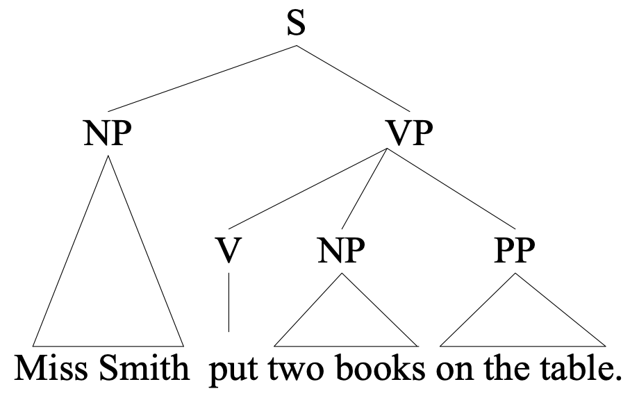
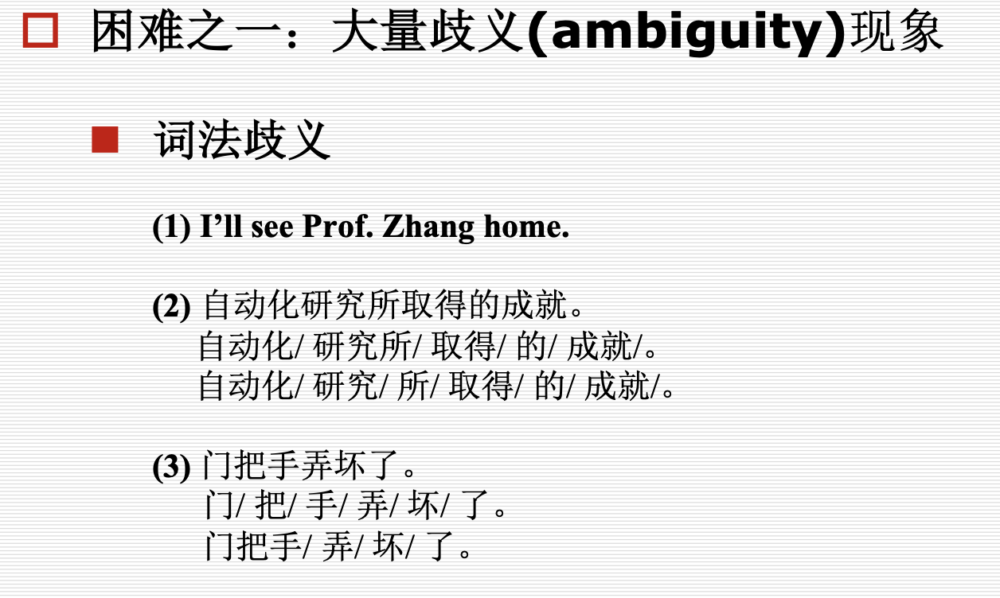
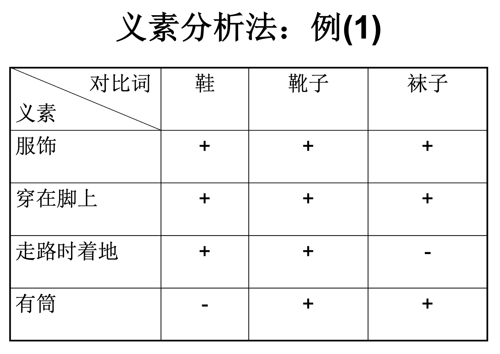
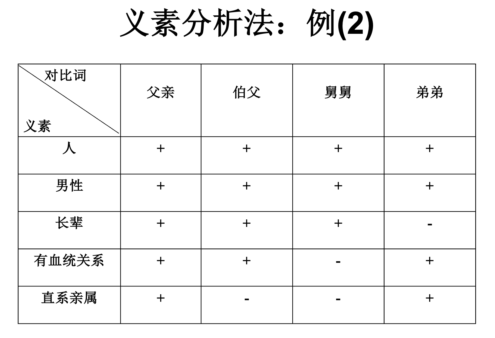

[toc]

## 1 绪论

### nlp的主要困难

  * 
  * 结构歧义（e.g. 喜欢乡下的孩子。）
  * 语义歧义（意思意思，真有意思）
  * 语音歧义（石室诗士施氏，嗜狮，誓食十狮）
  * 未知语言（新词）

### 研究方法

1. 理性主义：认为语言知识与生俱来的（？）
   * 研究对象：人的语言知识结构
   * 理论依据：通常基于**Chomsky** 的语言原则(principles)，通过语言所必须遵守的一系列原则来描述语言
   * 处理方法：通常通过一些特殊的语句或语言现象的研究来得到对人的语言能力的认识，而这些语句和语言现象在实际的应用中并不常见
   * 求解方法：
2. 经验主义：语言知识通过感官输入，经过一些简单的联想与通用化的操作得到的。
   * 研究对象：实际的语言数据
   * 理论依据：通常是基于**Shannon** 的信息论、概率统计、机器学习等
   * 处理方法：偏重于对大规模语言数据中人们所实际使用的普通语句的统计
   * 求解方法：

## 2. 形式语言与自动机

* 基本概念

  * 文法
    * 给出生成语言中所有句子的方法
    * 当且仅当能够用该方法产生的句子才属于该语言
  * 自动机
    * 给出识别该语言中句子的机械方法

* 形式文法

  * 四元组进行描述{VT, VN, S, P}

    * VT：终结符（Terminals）(单词)
    * VN：非终结符（Non-terminals）（形式变量）
    * S：起始符（形式变量，归在VN中，不用写）
    * P：具体的生成规则

  * 例子

    设形式文法G的

    VT={the, John, ate, apple}，

    VN={S, NP, VP, ART, N, V, NAME}, 

    $P={1. S\rightarrow NP\quad VP, 2. VP\rightarrow V\quad NP, 3. NP\rightarrow NAME, 4. NP\rightarrow ART\quad N, 5. NAME\rightarrow John, 6. V\rightarrow ate, 7. ART\rightarrow the, 8. N\rightarrow apple}$

    其中NP代表名词短语、VP代表动词短语等等。则句子“John ate the apple”的生成过程如下

    1，3，5；2，6；4，7，8

       S - NP VP            (重写S)

    ​     NAME VP         (重写NP)

    ​     John VP          (重写NAME)

    ​     John V NP         (重写VP)

    ​     John ate NP        (重写V)

    ​     John ate ART N     (重写NP)

    ​     John ate the N      (重写ART)

    ​     John ate the apple   (重写N) 

* 乔姆斯基文法（看不懂，ppt写得太垃圾）
  * 一种短语文法（PSG：Phrasal Structure Grammar）
* 索引文法（没具体例子，ppt太垃圾）
  * 和形式文法比起来多了个$V_I$表示索引的有限集合
* **范畴文法（重点）**
* 图灵机（pass）

## 3 句法分析

### 线图分析法

https://www.bilibili.com/video/BV1F541157oQ?spm_id_from=333.337.search-card.all.click

* CFG规则（e.g. $S \rightarrow NP,VP$）
* 看手写讲义

### CYK

视频时间开始 36.30

## 5 特征和扩充文法

## 6 统计语言模型

#### 信源信道模型

信源：生成输入信号，信号服从某种概率分布$P(I)$

信道：将输入信号准换成输出信号$P(O)$

信源-信道模型：已知输出，求解最有可能的输入

$$I=argmax_IP(I|O)=argmax_IP(O|I)P(I)$$

e.g. 

* 语音识别中，已知输出的语音O，求解输入的文本I

#### 统计语言模型

##### 完美模型
假定S为一个句子

$P(S=w_1w_2\dots w_m)=P(w_1)P(w_2|w_1)\dots P(w_m|w_1\dots w_{m-1})$

问题：虽然完美，计算过于复杂

##### Markov链模型（N-gram）

不考虑过旧的单词，只考虑最接近的N-1个词

#### 数据平滑

* 什么是数据平滑？

算单词概率时，很多单词出现的概率几乎为0，对模型的预测能力有很大的影响。

为了解决这一0概率问题，提出数据平滑，想法为加大0概率的单词的概率，但总概率和为1。

#### 现有统计模型

根据$P(w_i=w|C)=P(w_i=w)$划分

1. 上下文相关
   * N-gram: $P(w_i=w|C)=P(w_i=w|w_{i-n+1}^{i-1})$
   * N-pos模型：基于词性的N-gram模型
2. 上下文无关
   * $P(w_i=w)=1/N$

#### 语言模型评估

熵低的模型好

## 7 语义知识

* 语义：语言的意义
* 研究重点：语言与客观对象之间的关系
* 语义理论：建立一种简化的世界模型[^m]，模型和实际语言的某一子集之间的对应关系

[^m]:语言是用来描述客观世界和思维世界的

### 词义（不重要）

#### 词义分析

* 义位与义素

* 语义场与义素分析法

  

#### 术语解释

* 义位：义位是从具体语言或方言中归纳出来的、能够独立运用的、具有独立形式标志的最小意义单位（指具体的单词）

* 义素：义素是构成义位的最小意义单位，即义位的区别性特征。它是由分解义位得到的比义位低一级的语义单位。在语义体系中它是无法被直接观察到的，所以属于语义的微观层次。（指单词的特征）

* 语义场={单词｜在词义上具有类属关系的词}

  * e.g. 亲属语义场={妻子，哥哥，....}

* 义素分析法：义素分析法指从义素的角度分析义位的方法。

  * 义素分析法的步骤

    * 确定语义场
    * 比较语义场中的各个义位，找出共同特征和区别特征（义素）
    * 用得到的义素对各个义位进行描写

* E.g.

  

#### 词义组织

* 两种常见的方法

  * 分类法：将词义按同义关系组织成类，类与类之间按照上下文和其他关系组成分类体系

  * 分解法：将词义用更基本的单位（如义素或义原）来表示

* 所有词组织成体系
  * wordnet，hownet等工作

### 词义排歧

* 一词多义的情况，e.g. play video, plat piano
* 解决方法
  * 基于词典的方法
  * ML方法

#### 基于词典的方法

* **基本思想**：词典中词条本身的定义作为判断其语义的条件。
* 根据上下文来完成。

#### 有监督的方法

根据上下文建立多分类器，类别为同一单词的不同意义

### 语义结构
#### 格语法
#### 语义网络
#### 逻辑表示
### wordnet
### hownet

This is a test command.