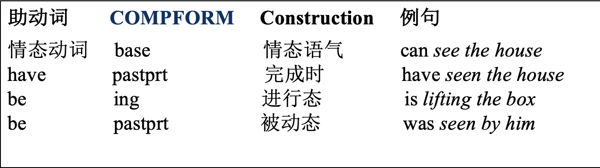
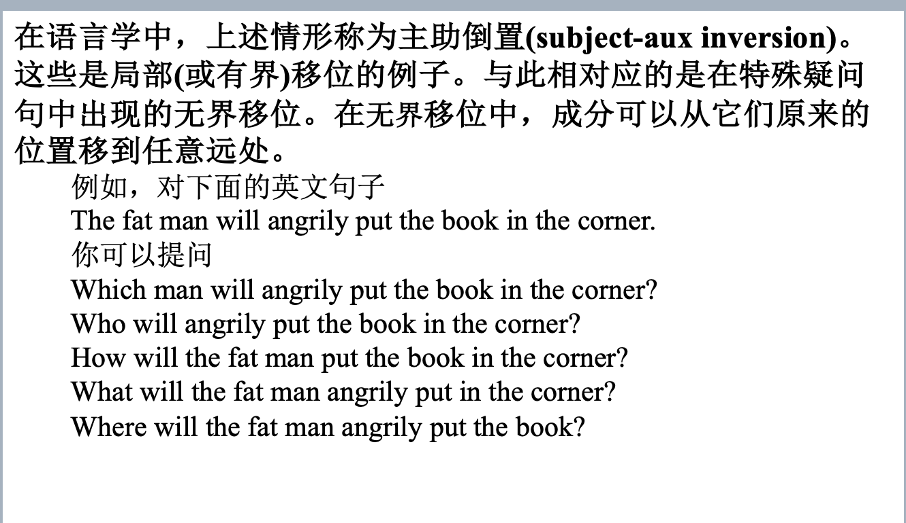
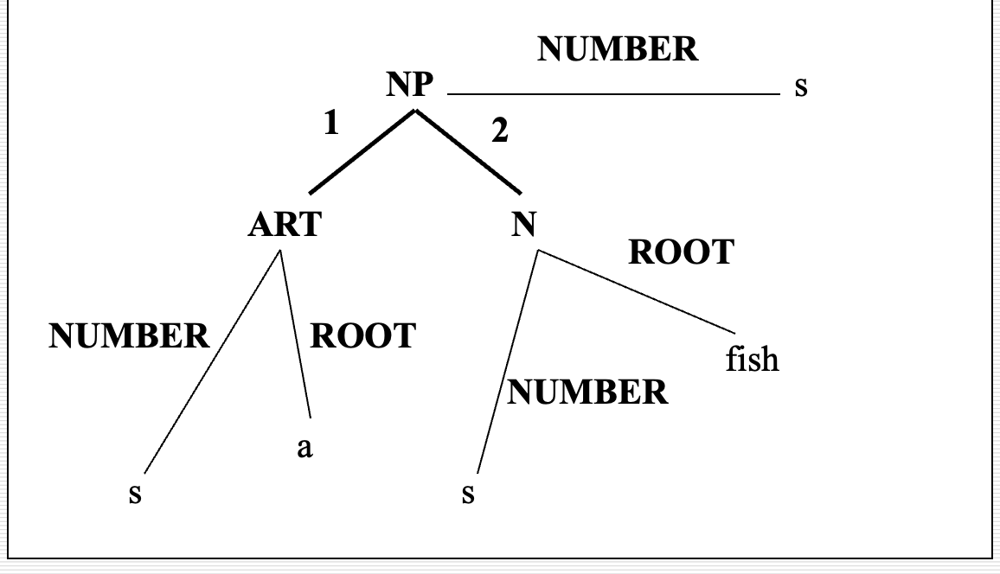

[toc]

## 1 绪论

### nlp的主要困难

  * 
  * 结构歧义（e.g. 喜欢乡下的孩子。）
  * 语义歧义（意思意思，真有意思）
  * 语音歧义（石室诗士施氏，嗜狮，誓食十狮）
  * 未知语言（新词）

### 研究方法

1. 理性主义：认为语言知识与生俱来的（？）
   * 研究对象：人的语言知识结构
   * 理论依据：通常基于**Chomsky** 的语言原则(principles)，通过语言所必须遵守的一系列原则来描述语言
   * 处理方法：通常通过一些特殊的语句或语言现象的研究来得到对人的语言能力的认识，而这些语句和语言现象在实际的应用中并不常见
   * 求解方法：
2. 经验主义：语言知识通过感官输入，经过一些简单的联想与通用化的操作得到的。
   * 研究对象：实际的语言数据
   * 理论依据：通常是基于**Shannon** 的信息论、概率统计、机器学习等
   * 处理方法：偏重于对大规模语言数据中人们所实际使用的普通语句的统计
   * 求解方法：

## 2. 形式语言与自动机

### 基本概念

* 文法
  * 给出生成语言中所有句子的方法
  * 当且仅当能够用该方法产生的句子才属于该语言
* 自动机
  * 给出识别该语言中句子的机械方法

### 形式文法

* 四元组进行描述$\{V_T, V_N, S, P\}$

  * $V_T$：终结符（Terminals）(单词)
  * $V_N$：非终结符（Non-terminals）（形式变量）
  * $S$：起始符（形式变量，归在VN中，不用写）
  * $P$：具体的生成规则

* 例子

  设形式文法G的

  $V_T$={the, John, ate, apple}，

  $V_N=\{S, NP, VP, ART, N, V, NAME\}$, 

  $P=\{1. S\rightarrow NP\quad VP, 2. VP\rightarrow V\quad NP, 3. NP\rightarrow NAME, 4. NP\rightarrow ART\quad N,\\ 5. NAME\rightarrow John, 6. V\rightarrow ate, 7. ART\rightarrow the, 8. N\rightarrow apple\}$

  其中NP代表名词短语、VP代表动词短语等等。则句子“John ate the apple”的生成过程如下

  1，3，5；2，6；4，7，8

     S - NP VP            (重写S)

  ​     NAME VP         (重写NP)

  ​     John VP          (重写NAME)

  ​     John V NP         (重写VP)

  ​     John ate NP        (重写V)

  ​     John ate ART N     (重写NP)

  ​     John ate the N      (重写ART)

  ​     John ate the apple   (重写N) 

### 乔姆斯基文法

* 刻画[形式文法](https://baike.baidu.com/item/形式文法)表达能力的一个分类谱系，由Chomsky于1956年提出的。
* 包括四个层次：0型，1型，2型，3型，由前到后有包含关系
* 下述表示中，大写英文字母表示非终结字符，希腊字母表示非终结与终结字符构成的字串。
* **0型文法**：短语文法，相当于图灵机（PSG：Phrasal Structure Grammar），半可判定的
  * 产生式：$\alpha\rightarrow\beta$（无限制）
  * 限制：$\alpha,\beta$为包含非终结符或终结符的字串，$\beta$可为空串；$\alpha$至少包含一非终结符
* **1型文法**：上下文有关文法，相当于线性有界非确定图灵机(CSG：Context Sensitive Grammar)，NP完全
  * 产生式：$\alpha A\beta\rightarrow \alpha\gamma\beta$
  * 限制：$A$非终结字符，$\gamma$不为空串，右侧不能包含$S$.
* **2型文法**：上下文无关文法，相当于非确定下推自动机(CFG: Context Free Grammar)，多项式的
  * 产生式：$A\rightarrow \gamma$
  * 限制：$A$非终结字符，$\gamma$字串
* **3型文法**：正规文法，相当于有限状态自动机，又分为左线性文法和右线性文法(RG: Regular Grammar)，线性复杂度的
  * **左线性文法**：产生式：$A\rightarrow Ba$或$A\rightarrow a$
    * 限制：$A，B$非终结符，$a$终结符
  * **右线性文法**：产生式：$A\rightarrow aB$或$A\rightarrow a$
    * 限制：$A,B$非终结符，$a$终结符

### 索引文法

(Index Grammar)介于1型和2型之间的语法类别，除此之外还有树粘接文法（TAG：Tree Adjoining Grammar）

* 定义为五元组$\{V_T, V_N,V_I, S, P\}$,和形式文法相比多出$V_I$表示索引的有限集合

* $P$为规则的有限集合，可能的形式如下，其中$A,B\in V_N,f\in V_I,\alpha\in(V_N\cup V_T)^*$

  * 1) $A\rightarrow\alpha$

    2. $A\rightarrow B(f)$

    3. $A(f)\rightarrow\alpha$

* 规则的推导如下,其中，当$X_i\in V_N,\delta_i=\delta; X_i\in V_T,\delta_i=\varepsilon$

  * 形如1.的规则$A\rightarrow X_1 X_2\cdots X_k$,$\beta A(\delta)\gamma\Rightarrow\beta X_1(\delta_1)X_2(\delta_2)\cdots X_k(\delta_k)\gamma$
  * 形如2.的规则$A\rightarrow B(f)$，$\beta A(\delta)\gamma\Rightarrow\beta B(f\delta)\gamma$
  * 形如3.的规则$A(f)\rightarrow X_1X_2\cdots X_k$,$\beta A(f\delta)\gamma\Rightarrow\beta X_1(\delta_1)X_2(\delta_2)\cdots X_k(\delta_k)\gamma$

* 其他文法：链文法，依存文法，范畴文法

### 范畴文法

* 核心思想：把语言中的各种成分对应为某种类型/范畴，把构造过程对应为其演算过程。
* 基本范畴：句子$S$，名词$N$
* 任意一个语言成分的范畴由$S,N$和运算符'/','\\','(',')'构成
* 两语言成分间发生结合关系时作对应的“乘法”运算，关键在于“约分”
* 不同词性的**范畴表示**和**举例**见第二章P5
* 存在问题：

  * 范畴标记和词性不是一一对应的，确定具体词的范畴标记有难度；
  * 不负载在词上的结构（如汉语的联合结构（今天或明天）、连谓结构（他**站**起来**走**过去**拿**书））很难纳入范畴语法；
  * 超距相关的成分（如“王冕死了父亲”中的“王冕”和“父亲”）很难建立约分关系；
  * 像汉语这样语序灵活、填项省略的语言很难用范畴文法描述。

* 图灵机：第二章P6-7

用上下文无关文法描述自然语言：

* 1. 正则语法描述能力太弱，CSG计算复杂度太高；
  2. CFG的二分特性与人类心理思维规律接近；
  3. CFG能反映自然语言句子的层次特性，从而得到句子的句法结构；
  4. CFG能表示句法歧义（见第二章P9）
  5. 从描述能力而言，CFG不足以描述自然语言，为了弥补需要其他手段扩充其描述能力。

## 3 句法分析

### 自顶向下分析法

* 又称基于预测的方法，先产生对出现成分的预期，再分析字符以验证预期

* 基础的分析过程见ppt第三章P1-4

* **一种改进方法：**在状态描述中加入正整数表示分析的当前位置

Eg. $ _1\ The\ _2\ old\ _3\ man\ _4\ cried\ _5$,分析过程见第三章P5

### 自底向上分析法-线图分析法

* 又称基于归约的方法，若整个字符串被归约为$S$,则分析成功。

* agenda选取数据结构：堆栈-深度优先，队列-广度优先

https://www.bilibili.com/video/BV1F541157oQ?spm_id_from=333.337.search-card.all.click

* 举例：分析句子 $ _1\ the\ _2\ boy\ _3\ hits\ _4\ the\ _5\ dog\ _6$

* | Rules                                                        |
  | ------------------------------------------------------------ |
  | $S\rightarrow NP\ \ VP$, $NP\rightarrow ART\ \ N$, $VP\rightarrow V\ \ NP $, $VP \rightarrow VP\ \ PP$ , $PP\rightarrow Prep\ \ NP$ |

  | agenda                 | active                        | closed                        |
  | ---------------------- | ----------------------------- | :---------------------------- |
  | ART ($1\rightarrow 2$) | NP$\rightarrow$ ART $\circ$ N |                               |
  | N$(2\rightarrow3$)     |                               | NP$\rightarrow$ ART N $\circ$ |
  | NP(1$\rightarrow$3)    | S$\rightarrow$NP $\circ$ VP   |                               |
  | V(3$\rightarrow$4)     | VP$\rightarrow$V $\circ$ NP   |                               |
  | ART (4$\rightarrow$5)  | NP$\rightarrow$ ART $\circ$ N |                               |
  | N(5$\rightarrow$6)     |                               | NP$\rightarrow$ Det N $\circ$ |
  | NP(4$\rightarrow$6)    |                               | VP$\rightarrow$ V NP $\circ$  |
  | VP(3$\rightarrow$ 6)   |                               | S$\rightarrow$ NP VP $\circ$  |

### 自底向上分析法-CYK

| S    |      |      |      |      |
| ---- | ---- | ---- | ---- | ---- |
|      |      |      |      |      |
|      |      | VP   |      |      |
| NP   |      |      | NP   |      |
| ART  | N    | V    | ART  | N    |
| the  | boy  | hits | the  | Dog  |

### 转移网络文法

转移网络由节点和带标记的弧组成，一个节点被定义为初始节点。

递归转移网络（Recursive Transition Network），弧不仅可以指向词性，也可指向其他网络。

具体分析过程见第三章P11

### 自顶而下线图分析法

略，分析过程见第三章P12

## 4 自然语言句法

### 英语助动词

* 助动词：can + VP[pres]， will have + VP[pastprt] ， was + VP[ing]，should have + VP[pastprt]

* 简单句中，首次出现的动词必须与主语的AGR一致，且必为限定式的。
* 解决方案：通过引入助动词的次范畴特征约束其后的VP，来描述有助动词的句子结构。
* 助动词的分类：
  * 主要助动词：be，have，既能做助动词，也能做主动词，分列词典不同的条目；
  * 情态动词：只以限定式出现：do(did), can(could), may(might), shall(should), will(would), must, need及dare；另外还有可充当此功能的短语，如ought to, used to, 及be going to。
* **添加规则：**$VP\rightarrow (AUX\ COMPFROM\ ?s)(VP\ VFORM\ ?s)$
  * 其中**COMPFORM**特征即用来显示助动词后VP的VFORM特征
  * COMPFORM取值范围
  * 
  * 用上述规则可能有过生成的问题，e.g. I must be having been singing. 对上述规则合理
  * 引入新布尔特征MAIN，表示动词为主动词（+）还是助动词（-），关于be的规则写为：
  * $VP\rightarrow AUX[be]\ VP[ing,\ +MAIN]$
  * 常见的助动词的词典用法见第四章P3

### 被动语态

* 引入新的布尔特征PASS表示VP是否为被动语态；
* 新规则：$VP\rightarrow\ AUX[be]\ VP[ing,\ +PASS],\ VP[+PASS]\rightarrow AUX[be]\ VP[pastprt,\ +MAIN]$
* 问题：被动语态中，VP可能缺少作为宾语的NP
  * 引入新的布尔特征PASSGAP表示VP是否为被动语态且缺少宾语NP
  * 规则分解为：$VP[-passgap,\ +MAIN]\rightarrow\ V[\_np]\ NP,\ VP[+passgap,\ +MAIN]\rightarrow V[\_np]$
* 被动语态常用文法见第四章P3

### 语言中的移位现象

* 英语中疑问句具有的规律
* 一般疑问句：**局部移位**，主语与助动词互换（**主助倒置**），若没有助动词则需添加do作为助动词；
* 特殊疑问句：**无界移位**，删去提问的部分，替换为对应的疑问词置于句首；
  * 
* 困难：
  * 考虑上述例子，对 What will the fat man **angrily put in the corner**?
    * angrily put in the corner不是陈述句中一个合法的VP（缺少 the book），只在疑问句中合法；
    * 上述有缺失部分的VP只能对应特殊疑问词what，与其他疑问词组合也是不合法的（如where）。
    * **（*）**不能对从句里的词提问，如The man who was holding two balloons will put the box in the corner. 中对balloons提问
  
* 常见的分析方法
  * 句子缺失的成分称为**缺位(gap)**，移入的成分称为**填充成分(filler)**
  * e.g. 
    * What will the fat man angrily put in the corner? -> angrily put what in the corner?
    * What will the fat man angrily put the book in?” - > angrily put the book in what?
  * 分析时，假定疑问词填充gap，对填充后的句子进行测试，包括主谓一致性，代词的格和动词的及物性等。

### 上下文无关文法中的疑问句处理

#### 一般疑问句

* $  S[+INV]\rightarrow (AUX\ AGR\ ?a\ \ SUBCAT\ ?v)(NP \ AGR\ ?a) (VP\ \ VFORM\ ?v)$
  * +INV：倒桩句 ，AUX在NP前；
  * 助动词 AUX和主语NP的AGR（人称单复数）一致；
  * AUX和VP的VFORM一致。

#### 特殊疑问句（难点）

* 引入特征**GAP**来处理特殊疑问句，该特征从母成分传向子成分，直至在句中找到缺位的合适位置。
* 规则右边是缺位的，故不需要有输入$(\varepsilon)$,
* e.g. $(NP\ GAP\ ((CAT\ NP)\ (AGR\ ?a))\ AGR\ ?a\ )\rightarrow\varepsilon$
  * 表示当前缺位的成分为NP，则该规则可直接“无中生有”得到一个NP成分。

##### 	传递GAP特征的文法

 	*  该类文法有两种通用方法,取决于**中心成分**是否为词性**（CAT）**：
 	*   $(S\ GAP\ ?g)\rightarrow\ (NP\ GAP\ -)(VP\ GAP\ ?g)$的GAP属性只能包含在VP中
 	*   中心成分为词性的规则，能导出两条规则，缺位能且仅能出现在一个位置：$(VP\ GAP\ ?g)\rightarrow V[\_np\_pp](NP\ GAP\ ?g)(PP\ GAP\ -),\quad (VP\ GAP\ ?g)\rightarrow V[\_np\_pp](NP\ GAP\ -)(PP\ GAP\ ?g)$

##### 	Filler的产生

* 引入特征**WH**，若值为Q表示该词（或短语）可以引导问句，若值为R表示可以引导从句（见关系从句）；
* 常用的特殊疑问词在字典中的特征见第四章P6
* 由此得到处理特殊疑问句的文法，同见P6

### 带缺位的句法分析

考到看ppt现学吧，第四章P6-7

### 关系从句

* 基础规则：$CNP\rightarrow CNP\ REL$
* REL表示从句，关系从句与特殊疑问句结构相似，疑问词作连接词，后接带gap的S。
* e.g.$REL\rightarrow\ (NP\ WH\ R\ AGR\ ?a)(S[-INV,fin]\ GAP(NP\ AGR\ ?a))$ 
  * 如 man（CNP）who（NP WH R AGR {1s,...}) I visit (S[-INV,fin] GAP（NP AGR {1s}))
* e.g. $REL\rightarrow\ (PP\ WH\ R\ PFORM\ ?a)(S[-INV,fin]\ GAP(PP\ PFORM\ ?a))$ 
  * 如 place (CNP) where (PP WH R PFORM loc) we visit (S[-INV,fin] GAP(PP PFORM loc))

* 疑问词充当主语：$REL\rightarrow NP[R]\ VP[fin]$
  * 如 man who visits me
* 不以疑问词开头的从句：$REL \rightarrow(S[fin]\ GAP\ (NP\ AGR\ ?a)),\ REL\rightarrow(VP\ VFORM\ \{ing,\ pastprt\})$
  * 如 the one I chose, the work done by her, the man leaving the room等

## 5 特征和扩充文法

### 特征系统与扩充句法

#### 特征系统

* 句子成分之间的搭配有一定的**约束**（如名词的单复数和冠词单复数的对应关系）

* 方便的做法是引入**特征结构**（feature structure）来定义成分。

  * e.g. 冠词a

    * **ART1: (CAT ** **ART** 词性特征

      ​       **ROOT** **a** 词根

      ​       **NUMBER** **s)** 单复数特征 

* 特征结构之间可以嵌套组成表达能力更强的特征结构

  * e.g. a fish

    * NP1: (NP **NUMBER** s

      ​       **1** (ART **ROOT** a **NUMBER** s)

      ​       **2** (N **ROOT** fish **NUMBER** s)) 

    * 分析树形式

    * 

#### **扩充文法（重点）**

* 通过引入句子成分的特征变量来实现扩充

* $(NP\ \ NUMBER?n)\rightarrow(ART\ \ NUMBER?n) (N\ \ NUMBER ?n)$
  * 这个规则暗含了NP，ART，N这三个成分的NUMBER特征的值要相同，因此
    
  * 1. $( NP\quad 1\ (ART\ \boldsymbol{NUMBER}\ s)\quad 2\ (N\ \boldsymbol{NUMBER}\ s))$
    2. $( NP\ \boldsymbol{NUMBER}\ s\quad 1\ (ART\ \boldsymbol{NUMBER}\ s)\quad 2\ (N\ \boldsymbol{NUMBER}\ p))$
    
    都是不合法的，1中NP不包含NUMBER，2中NUMBER特征不一致
  
* 二义性：
  * fish单复数同行，在词典中可表示为$(N\ \boldsymbol{ROOT}\ fish\ \boldsymbol{NUMBER}\ ?n)$,表示特征可选；
  * 约束变元：$(N\ \boldsymbol{ROOT}\ fish\ \boldsymbol{NUMBER}\ ?n\{s\ p\})$

### 英语的基本特征系统

*  人称和数（第1/2/3人称单/复数）**(AGR)**

  * 可能的取值{1,2,3}与{s,p}组合. (s:single, p:plurality)
  * eg.  be动词$are$的AGR特征取值可以是$\{2s, 1p, 2p, 3p\}$
*  动词形式**(VFORM)**

  * 表示动词或动词短语的时态变化或形式

  * 可能的取值

    * **base**—**动词原型**
    * **pres**—**一般现在时**
    * **past**—**一般过去时**
    * **fin**—**限定式**(finite，等价于{**pres**, **past**})
    * **ing**—**现在进行时**
    * **pastprt**—**过去完成时**
    * **inf**—**不定式**（to+动词原型）
*  **动词次范畴(SUBCAT)**
   *  处理词与其**补足语**之间的相互作用

      *  e.g. I can't get him to talk.
      *  $  (VP) \rightarrow\{(V\ \ SUBCAT \_np\_vp: inf)(NP)(VP\ \  VFORM\ \ inf)\}$

      *  VFORM：inf 不定式，
      *  SUBCAT: get sb. to do 动词get接NP（NP -- him）再接一个VP中的不定式作为补足语（VP:inf -- to talk）
   *  **介词短语（PP）做补语**，其对应的特征变量为**PFORM**，取值有
      *  TO：短语以to开头**（注意与VFORM：inf的区分）**
      *  LOC：描述地点，包括in, on, by, inside, on top of ....
      *  MOT：描述路径或运动方向, 包括to, from, along（we walked to the store ）
   *  **从句（S）做补语**，由that或for开头的从句接在动词短语后，**SUBCAT**值记为_s:that, _s:for
   *  布尔特征：只有两个可能取值的特征，e.g. S结构的特征**INV**表示是否倒桩，记为**+INV，-INV**
   *  SUBCAT的一些取值及例子见第五章ppt

### 词语形态分析与词典

* 词语形态分析的规则用于分析动词变形，使词典无需将所有变形全部记录。
  * e.g. 产生动词第三人称单数一般现在时的变换规则：
  * $(V\ ROOT\ ?r\ SUBCAT\ ?s\ VFORM\ pres\ AGR\ 3s)\rightarrow(V\ ROOT\ ?r\ SUBCAT\ ?s\ VFORM\ base) + \text{字母s}$
  * 由上述规则，输入want：$(V\ ROOT\ want\ SUBCAT\ \_np\_vp:inf\ VFORM\ base)$即得
  * wants：$(V\ ROOT\ want\ SUBCAT\ \_np\_vp:inf\ VFORM\ pres\ AGR\ 3s)$
* 其对不规则变换的动词难以适用。e.g. be的VFORM：base (be) 和VFORM：pres（am, is, are）不规则
* 改进：引入布尔特征**IRREG-PRES**，表示动词是否具有irregular的present form，上述规则修改为
  * $(V\ SUBCAT\ ?s\ VFORM\ pres\ AGR\ 3s)\rightarrow(V\ SUBCAT\ ?s\ VFORM\ base\ IRREG-PRES -) + \text{字母s}$
* 需要指明的不规则特征：IRREG-PRES（现在时），IRREG-PAST（过去时），IRREG-PL（复数），EN-PASTPRT（完成时+en还是+ed），不进行说明时，所有默认值均为“-”。
* 动词时态变化的语法规则，以及常见动词的不规则特征值见第五章P5

### 书写特征文法规则时省略的约定

* 1.无歧义的取值可以省略特征名（如inf只存在VFORM：inf，可将(VP VFORM inf)省略为VP[inf] )
* 2.布尔特征统一简化为C[+B] (如 S[-INV],V[+IRREG-PRES])
* 3.规则左右两边取值相同的特征称为**中心特征**，若其被独立定义，则文法中可省略
  * S和VP的中心特征：VFORM，AGR； NP的中心特征：AGR
* 简化前后的文法实例见第五章P6
* 针对扩充文法的线图分析法实例见第五章P7

### 通用特征系统与合一文法

* 将特征结构表示为有向图（DAG）

* 其中，没有输入边的结点称为源（source），DAG有唯一源点，称为根节点；没有输出边的结点称为汇（sink）；
* 图合一算法（第五章P11-13）

## 6 统计语言模型

#### 信源信道模型

信源：生成输入信号，信号服从某种概率分布$P(I)$

信道：将输入信号准换成输出信号$P(O)$

信源-信道模型：已知输出，求解最有可能的输入

$$I=argmax_IP(I|O)=argmax_IP(O|I)P(I)$$

e.g. 

* 语音识别中，已知输出的语音O，求解输入的文本I

#### 统计语言模型

##### 完美模型
假定S为一个句子

$P(S=w_1w_2\dots w_m)=P(w_1)P(w_2|w_1)\dots P(w_m|w_1\dots w_{m-1})$

问题：虽然考虑了完整的概率模型，但参数太多难以计算，模型中有$L^m$个参数。

##### Markov链模型（N-gram）

不考虑过旧的单词，只考虑最接近的N-1个词，称为$n-1$阶Markov链近似

一元Unigram，二元Bigram，三元Trigram

* 更大的N：对下一个词的约束性信息更多，具有更大的**辨别力**

* 更小的N：训练语料库中出现的次数更多，具有更高的**可靠性**

* 需要对其进行折中
* 计算N-gram模型的过程见第六章P5

#### 数据平滑

* 什么是数据平滑？

​	零概率问题：计算单词概率时，大量低频词的似然概率为0，严重削弱了模型的预测能力。

​	为解决该问题，提出**数据平滑**，加大零概率单词的概率，改进整体正确率。

* 困惑度（Perplexity）：$PP_P(T)=2^{H_P(T)},\ H_p(T)=-\frac{1}{W_T}\log_2 P(T)$
* **加1平滑**：每一种情况出现的次数都加1.（P7）
* 减值法/折扣法
* Good-Turing估计
* 线性插值平滑

#### 现有统计模型

根据$P(w_i=w|C)=P(w_i=w)$划分

1. 上下文相关
   * N-gram: $P(w_i=w|C)=P(w_i=w|w_{i-n+1}^{i-1})$
   * N-pos模型：基于词性的N-gram模型
2. 上下文无关
   * $P(w_i=w)=1/N$

#### 语言模型评估

熵低的模型好

## 7 语义知识

* 语义：语言的意义
* 研究重点：语言与客观对象之间的关系
* 语义理论：建立一种简化的世界模型，模型和实际语言的某一子集之间的对应关系

### 词义

#### 词义分析

* 义位与义素

* 语义场与义素分析法

#### 术语解释

* 义位：义位是从具体语言或方言中归纳出来的、能够独立运用的、具有独立形式标志的最小意义单位（指具体的单词）

* 义素：义素是构成义位的最小意义单位，即义位的区别性特征。它是由分解义位得到的比义位低一级的语义单位。在语义体系中它是无法被直接观察到的，所以属于语义的微观层次。（指单词的特征）

* 语义场={单词｜在词义上具有类属关系的词}

  * e.g. 亲属语义场={妻子，哥哥，....}

* 义素分析法：义素分析法指从义素的角度分析义位的方法。

  * 义素分析法的步骤

    * 确定语义场
    * 比较语义场中的各个义位，找出共同特征和区别特征（义素）
    * 用得到的义素对各个义位进行描写

* E.g.

  

#### 词义组织

* 两种常见的方法

  * 分类法：将词义按同义关系组织成类，类与类之间按照上下文和其他关系组成分类体系

  * 分解法：将词义用更基本的单位（如义素或义原）来表示

* 所有词组织成体系
  * 现有wordnet，hownet等工作

### 知识本体

	* 对概念体系的明确的、形式化的、可共享的规范，本质是对概念和概念之间的关系进行明确的、形式化的描述
	* 常见的关系：上下位关系、整体部分关系、同义/近义/反义/对义关系

### 词义排歧

* 一词多义的情况，e.g. 打人，打球，打饭，打渔； play football, play the piano，play game
* 选择限制：词义之间的搭配不是任意的，存在一定的固定搭配，故选择限制被广泛用于词义歧义的消解，如
  * “油”：飞机的油耗尽了；油多不坏菜
  * 'mouse': The mouse stole the egg./ Click the mouse and press Enter.

* **排歧方法分类**:一个词的不同语义一般发生于不同的上下文中。
  * 基于词典的方法
  * 基于机器学习（语料库）的方法
    * 有监督的方法
      * 基于实例的方法
      * 统计ML的方法：Bayes，互信息，决策树，最大熵，SVM，粗糙集...
    * 无监督的方法
      * 词义聚类
      * 语料增强：Bootstraping
      * 双语语料增强方法

#### 基于词典的方法

##### 	基于语义定义的消歧

* **基本思想**：词典中词条本身的定义作为判断其语义的条件。

##### 	基于义类辞典的消歧

	* 基本思想：多义词的不同义项在使用时具有不同的上下文语义类，通过上下文语义范畴判断多义词使用的义项。

#### 有监督的方法

建立多分类器，利用划分多义词的上下文类别方法区分多义词的词义。

##### 基于互信息的消歧方法

##### 基于Bayes的消歧方法

### 词义的泛指和特指

​	汉语中没有限定词（如英语的冠词），名词短语的泛指和特指难以判定，必须结合上下文。

### 语义结构
#### 格语法

	* 句法分析不足以完全刻画句子中词语之间的语义关系，如动宾关系，诸位关系等，需定义另外一套体系（格）
	* 格语法分析句子见PPT
 * 格语法的缺陷：
   * 转换的思想随语言学发展已被摒弃
   * 格集合的确定没有客观标准，不同的具体应用有不同的格集合
   * 实际应用中如何定义格集合都存在太粗或太细的问题
   * 格语法描述汉语存在局限性，如连动句/兼语句：他拿了书就上楼去了；我们选他当班长

#### 语义网络

* 基本思想：用有向图表示语义结构，结点表示概念/实体/事件，弧表示关系，包括ISA(具体-抽象关系)，KINDOF(类属)等
* 语义网络可以表达各种逻辑关系，也可以进行逻辑推理，具有表达能力强、方便、直观等特点，在很多场合有应用。

#### 逻辑表示

* 略

### 语义分析

* 目标：生成一个与上下文无关的语义表示形式
* 解决问题：词义排歧；语义关系排歧；更复杂的（量词辖域判定、名词定指判定、指代消解）
* 两种做法：
  * 直接语义分析：不通过句法分析阶段，直接对源语言语义分析，包括语义语法、统计语义分析法
  * 基于句法的语义分析：先通过句法分析得到句子的句法结构，再进行语义分析，包括选择限制与语义优选、统计语义排歧
* 例题见PPT

### wordnet
### hownet

## 高效分析方法

### 标准LR分析方法

基本思想：

	* 利用预读字符（Lookahead）和当前状态决定下一步分析动作
	* 状态由二元组构成：点规则，和规则完成后的后续字符

LR分析算法分为如下分析动作：移进（shift）、归约（reduce）、成功（accept）、报错（error）

算法的过程描述及示例见PPT

**LR算法的不足**：1.不允许回溯 2. 只能分析标准LR文法，不能处理有歧义的文法

### Tomita算法/GLR算法

* GLR算法：
  * GLR分析表允许有多重入口（一个格子有多个动作）
  * 将线性分析栈改进为图分析栈处理分析动作的歧义
  * 采用共享子树结构表示局部分析结果，节省空间开销
  * 节点合并，压缩局部歧义
* 具体的GLR算法过程见PPT