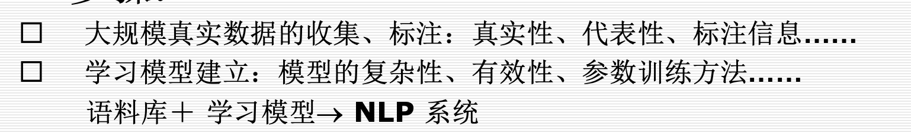

[toc]

## 1 绪论

### nlp的主要困难

* 词法歧义（自动化/研究所/取得的成就，自动化/研究/所取得的成就）

  * 结构歧义（e.g. 喜欢乡下的孩子。）
  * 语义歧义（意思意思，真有意思）
  * 语音歧义（石室诗士施氏，嗜狮，誓食十狮）
  * 未知语言（新词）

### 研究方法

1. 理性主义：认为语言知识与生俱来的（？）
   * 研究对象：人的语言知识结构
   * 理论依据：通常基于**Chomsky** 的语言原则(principles)，通过语言所必须遵守的一系列原则来描述语言
   * 处理方法：通常通过一些特殊的语句或语言现象的研究来得到对人的语言能力的认识，而这些语句和语言现象在实际的应用中并不常见
   * 求解方法：
2. 经验主义：语言知识通过感官输入，经过一些简单的联想与通用化的操作得到的。
   * 研究对象：实际的语言数据
   * 理论依据：通常是基于**Shannon** 的信息论、概率统计、机器学习等
   * 处理方法：偏重于对大规模语言数据中人们所实际使用的普通语句的统计
   * 求解方法：

## 2. 形式语言与自动机

* 基本概念

  * 文法
    * 给出生成语言中所有句子的方法
    * 当且仅当能够用该方法产生的句子才属于该语言
  * 自动机
    * 给出识别该语言中句子的机械方法

* 形式文法

  * 四元组进行描述$\{V_T, V_N, S, P\}$

    * $V_T$：终结符（Terminals）(单词)
    * $V_N$：非终结符（Non-terminals）（形式变量）
    * $S$：起始符（形式变量，归在VN中，不用写）
    * $P$：具体的生成规则

  * 例子

    设形式文法G的

    $V_T$={the, John, ate, apple}，

    $V_N=\{S, NP, VP, ART, N, V, NAME\}$, 

    $P=\{1. S\rightarrow NP\quad VP, 2. VP\rightarrow V\quad NP, 3. NP\rightarrow NAME, 4. NP\rightarrow ART\quad N,\\ 5. NAME\rightarrow John, 6. V\rightarrow ate, 7. ART\rightarrow the, 8. N\rightarrow apple\}$

    其中NP代表名词短语、VP代表动词短语等等。则句子“John ate the apple”的生成过程如下

    1，3，5；2，6；4，7，8

       S - NP VP            (重写S)

    ​     NAME VP         (重写NP)

    ​     John VP          (重写NAME)

    ​     John V NP         (重写VP)

    ​     John ate NP        (重写V)

    ​     John ate ART N     (重写NP)

    ​     John ate the N      (重写ART)

    ​     John ate the apple   (重写N) 

* **乔姆斯基文法**
  * 一种短语文法（PSG：Phrasal Structure Grammar）
  * 刻画[形式文法](https://baike.baidu.com/item/形式文法)表达能力的一个分类谱系，由Chomsky于1956年提出的。
  * 包括四个层次：0型，1型，2型，3型，由前到后有包含关系
  * 下述表示中，大写英文字母表示非终结字符，希腊字母表示非终结与终结字符构成的字串。
  * **0型文法**：短语文法，相当于图灵机
    * 产生式：$\alpha\rightarrow\beta$（无限制）
    * 限制：$\alpha,\beta$为包含非终结符或终结符的字串，$\beta$可为空串；$\alpha$至少包含一非终结符
  * **1型文法**：上下文有关文法，相当于线性有界非确定图灵机
    * 产生式：$\alpha A\beta\rightarrow \alpha\gamma\beta$
    * 限制：$A$非终结字符，$\gamma$不为空串，右侧不能包含$S$.
  * **2型文法**：上下文无关文法，相当于非确定下推自动机
    * 产生式：$A\rightarrow \gamma$
    * 限制：$A$非终结字符，$\gamma$字串
  * **3型文法**：正规文法，相当于有限状态自动机，又分为左线性文法和右线性文法
    * **左线性文法**：产生式：$A\rightarrow Ba$或$A\rightarrow a$
      * 限制：$A，B$非终结符，$a$终结符
    * **右线性文法**：产生式：$A\rightarrow aB$或$A\rightarrow a$
      * 限制：$A,B$非终结符，$a$终结符

* **范畴文法（重点）**
  *  核心想法：把语言中的**各种成分对应为某种“类型”/“范畴”**，把语言结构的**构造过程对应为”类型“/“范畴”**之间的演算过程
  *  基本范畴：S（句子），N（名词）
  *  一个语言成分的范畴由基本范畴加上范畴表达式构造符 { “/”， “\”,  "(",  ")"  }构成
     *  \:左缺
     *  /:右缺
     *  ():结合顺序
  *  e.g.
     *  
     *  

### 范畴文法

* 核心思想：把语言中的各种成分对应为某种类型/范畴，把构造过程对应为其演算过程。
* 基本范畴：句子$S$，名词$N$
* 任意一个语言成分的范畴由$S,N$和运算符'/','\\','(',')'构成
* 两语言成分间发生结合关系时作对应的“乘法”运算，关键在于“约分”
* 不同词性的**范畴表示**和**举例**见第二章P5
* 存在问题：

  * 范畴标记和词性不是一一对应的，确定具体词的范畴标记有难度；
  * 不负载在词上的结构（如汉语的联合结构（今天或明天）、连谓结构（他**站**起来**走**过去**拿**书））很难纳入范畴语法；
  * 超距相关的成分（如“王冕死了父亲”中的“王冕”和“父亲”）很难建立约分关系；
  * 像汉语这样语序灵活、填项省略的语言很难用范畴文法描述。

### 索引文法

* 索引文法（没具体例子，ppt太垃圾）
  * 和形式文法比起来多了个$V_I$表示索引的有限集合

(Index Grammar)介于1型和2型之间的语法类别，除此之外还有树粘接文法（TAG：Tree Adjoining Grammar）

* 定义为五元组$\{V_T, V_N,V_I, S, P\}$,和形式文法相比多出$V_I$表示索引的有限集合

* $P$为规则的有限集合，可能的形式如下，其中$A,B\in V_N,f\in V_I,\alpha\in(V_N\cup V_T)^*$

  * 1) $A\rightarrow\alpha$

    2. $A\rightarrow B(f)$

    3. $A(f)\rightarrow\alpha$

* 规则的推导如下,其中，当$X_i\in V_N,\delta_i=\delta; X_i\in V_T,\delta_i=\varepsilon$

  * 形如1.的规则$A\rightarrow X_1 X_2\cdots X_k$,$\beta A(\delta)\gamma\Rightarrow\beta X_1(\delta_1)X_2(\delta_2)\cdots X_k(\delta_k)\gamma$
  * 形如2.的规则$A\rightarrow B(f)$，$\beta A(\delta)\gamma\Rightarrow\beta B(f\delta)\gamma$
  * 形如3.的规则$A(f)\rightarrow X_1X_2\cdots X_k$,$\beta A(f\delta)\gamma\Rightarrow\beta X_1(\delta_1)X_2(\delta_2)\cdots X_k(\delta_k)\gamma$

* 图灵机：第二章P6-7

用上下文无关文法描述自然语言：

* 1. 正则语法描述能力太弱，CSG计算复杂度太高；
  2. CFG的二分特性与人类心理思维规律接近；
  3. CFG能反映自然语言句子的层次特性，从而得到句子的句法结构；
  4. CFG能表示句法歧义（见第二章P9）
  5. 从描述能力而言，CFG不足以描述自然语言，为了弥补需要其他手段扩充其描述能力。

## 3 句法分析

### 线图分析法

https://www.bilibili.com/video/BV1F541157oQ?spm_id_from=333.337.search-card.all.click

* CFG规则（e.g. $S \rightarrow NP,VP$）
* 看手写讲义

<!-- ### CYK

视频时间开始 36.30 -->

### 自顶向下分析法

* 又称基于预测的方法，先产生对出现成分的预期，再分析字符以验证预期

* 基础的分析过程见ppt第三章P1-4

* **一种改进方法：**在状态描述中加入正整数表示分析的当前位置

Eg. $ _1\ The\ _2\ old\ _3\ man\ _4\ cried\ _5$,分析过程见第三章P5

### 自底向上分析法-线图分析法

* 又称基于归约的方法，若整个字符串被归约为$S$,则分析成功。

* agenda选取数据结构：堆栈-深度优先，队列-广度优先

https://www.bilibili.com/video/BV1F541157oQ?spm_id_from=333.337.search-card.all.click

* 举例：分析句子 $ _1\ the\ _2\ boy\ _3\ hits\ _4\ the\ _5\ dog\ _6$

* | Rules                                                        |
  | ------------------------------------------------------------ |
  | $S\rightarrow NP\ \ VP$, $NP\rightarrow ART\ \ N$, $VP\rightarrow V\ \ NP $, $VP \rightarrow VP\ \ PP$ , $PP\rightarrow Prep\ \ NP$ |

  | agenda                 | active                        | closed                        |
  | ---------------------- | ----------------------------- | :---------------------------- |
  | ART ($1\rightarrow 2$) | NP$\rightarrow$ ART $\circ$ N |                               |
  | N$(2\rightarrow3$)     |                               | NP$\rightarrow$ ART N $\circ$ |
  | NP(1$\rightarrow$3)    | S$\rightarrow$NP $\circ$ VP   |                               |
  | V(3$\rightarrow$4)     | VP$\rightarrow$V $\circ$ NP   |                               |
  | ART (4$\rightarrow$5)  | NP$\rightarrow$ ART $\circ$ N |                               |
  | N(5$\rightarrow$6)     |                               | NP$\rightarrow$ Det N $\circ$ |
  | NP(4$\rightarrow$6)    |                               | VP$\rightarrow$ V NP $\circ$  |
  | VP(3$\rightarrow$ 6)   |                               | S$\rightarrow$ NP VP $\circ$  |

### 自底向上分析法-CYK

| S    |      |      |      |      |
| ---- | ---- | ---- | ---- | ---- |
|      |      |      |      |      |
|      |      | VP   |      |      |
| NP   |      |      | NP   |      |
| ART  | N    | V    | ART  | N    |
| the  | boy  | hits | the  | Dog  |

### 转移网络文法

转移网络由节点和带标记的弧组成，一个节点被定义为初始节点。

递归转移网络（Recursive Transition Network），弧不仅可以指向词性，也可指向其他网络。

具体分析过程见第三章P11

### 自顶而下线图分析法

略，分析过程见第三章P12

## 4 自然语言句法

### 助动词与动词短语

结合新规则和特征约束描述有助动词的句子结构

* 助动词的分类

  * 主要助动词：be, have
  * 情态动词:do, can,used to, be going to等等
* 处理方法

  * $VP \rightarrow(AUX\ COMPFORM?s)(VP\ VFORM?s)$
    * 其中COMPFORM表示一个特征，COMPFORM特征用来表明VP的VFORM是什么
    * Q：？s表示什么 ？AUX应该表示助动词
  * COMPFORM特征的取值范围
	* 
  * 助动词be需要进一步约束（由于be 后不能跟其他助动词）
    * $VP\rightarrow AUX[be]\ VP[ing,+MAIN]$
      * []表示前面的部分(AUX, VP)只取[]内的值
      * Q：+表示什么？

### 被动语态（pass）

定义了一些规则，看PPT

### 语言中的移位现象(介绍性)

* 一般疑问句的局部移位：中主语与助动词（或者额外加了个do）互换
* 特殊疑问句的无界移位：
  * 
* 处理方法
  * 由于特殊疑问句形式多样，希望能进行统一处理
  * 句子缺失的成分用缺位(gap)，移入的成分称为填充成分(filler)
  * e.g. 
    * What will the fat man angrily put in the corner? -> angrily put what in the corner?
    * What will the fat man angrily put the book in?” - > angrily put the book in what?

### 上下文无关文法中的疑问句处理

#### 一般疑问句的处理

* $  S[+INV]\rightarrow (AUX\ AGR?a\ \ SUBCAT ?v)(NP \ AGR ?a) (VP\ \ VFORM ?v)$
  * Q：+INV 应该是疑问句的表示方式？
  * VP 具有合适的VFORM
  * Q： AGR？a表示什么？，SUBCAT？v表示什么

#### 特殊疑问句（看ppt，可能比较重要）

### 关系从句（pass）

## 5 特征和扩充文法

### 特征系统与扩充句法

#### 特征系统

* 成分的搭配间需要满足一定的约束（名词的单复数），引入特征结构来对成分进行一步刻画

  * e.g. 冠词a

    * **ART1: (CAT ** **ART**

      ​       **ROOT** **a**

      ​       **NUMBER** **s)** 

    * ART1称为特征结构，CAT应该是指成分

* 特征结构之间可以嵌套组成表达能力更强的特征结构

  * e.g. a fish

    * NP1: (NP **NUMBER** s

      ​       **1** (ART **ROOT** a **NUMBER** s)

      ​       **2** (N **ROOT** fish **NUMBER** s)) 

    * 分析树形式

    * 

#### **扩充文法（重点）**

* 通过引入句子成分的特征变量来实现扩充
* $(NP\ \ NUMBER?n)\rightarrow(ART\ \ NUMBER?n) (N\ \ NUMBER ?n)$
  * 这个规则暗含了NP，ART，N这三个成分的NUMBER特征的值要相同，因此下面的例子不合法
    * 
* 一些规则规定
  * 

### 英语的基本特征系统

*  人称和数（第一人称单数，复数等等）

  * 一般用一个特征AGR表示，可能的取值{1,2,3}与{s,p}组合. (s:single, p:plurality)
  * are 的AGR特征取值$\{2s, 1p, 2p, 3p\}$

*  动词形式

  * 用特征VFORM表示

  * 可能的取值

    * **base**—**动词原型**
    * **pres**—**一般现在时**
    * **past**—**一般过去时**
    * **fin**—**限定式**(finite，等价于{**pres**, past})
    * **ing**—**现在进行时**
    * **pastprt**—**过去完成时**
    * **inf**—**不定式**

*  **动词次范畴**（重点）

   *  特征SUBCAT

   *  处理词与其**补足语**之间的相互作用

      *  e.g. I can't get him to talk.

      *  $  (VP) \rightarrow\{(V\ \ SUBCAT \_np\_vp: inf)$

         ​         $(NP)$

         ​         $(VP\ \  VFORM\ \ inf)\}$

      *  VFORM的inf取值对应不定式，动词get接NP（him）再接一个不定式作为补足语（to talk）

   *  补语结构中可能含有介词短语（PP）

      *  pp特征PFORM可能的取值
         *  TO：短语以to开头
         *  LOC：描述地点
         *  MOT：描述路径或运动方向（we walked to the store ）
      *  

   *  SUBCAT的一些取值及例子

      *  

   *  SUBCAT更多的例子（动词带从句作为补足语）

      *  

*  bool特征

   *  INV表示句子是否倒装，取值只有{+,-}
   *  Did jack laugh? S[+inv]
      *  通常bool特征的值放在bool特征名前

### 词态分析与词典(pass 看PPT)

* 利用规则来生成不同形态的单词（动词原形 到 动词现在进行时）

### 带特征的文法及其分析

* 一些约定
  * （VP VFORM inf）简记为（VP inf），不会有歧义，inf只有VFORM的取值能取到
  * bool特征 C[+ B] 表示 C[B +]
  * e.g. $VP\rightarrow(V\ \ SUBCAT\ \ \_np\_vp: inf)\ NP\ (VP\ \ VFORM\ \ inf)$ 简化为$VP \rightarrow V[\_np\_vp:inf]\ NP \ \ VP[inf] $

* PPT上一个具体例子 He wants to cry.

### 通用特征系统与合一文法

* DAG:基于合一的形式系统可以通过将特征结构表示为有向图(Directed Acyclic graph, DAG)
* e.g.
  * 
  * 

* DAG图的合一
  * 
  * 
  * 

## 6 统计语言模型

#### 信源信道模型

信源：生成输入信号，信号服从某种概率分布$P(I)$

信道：将输入信号准换成输出信号$P(O)$

信源-信道模型：已知输出，求解最有可能的输入

$$I=argmax_IP(I|O)=argmax_IP(O|I)P(I)$$

e.g. 

* 语音识别中，已知输出的语音O，求解输入的文本I

#### 统计语言模型

##### 完美模型
假定S为一个句子

$P(S=w_1w_2\dots w_m)=P(w_1)P(w_2|w_1)\dots P(w_m|w_1\dots w_{m-1})$

问题：虽然完美，计算过于复杂

##### Markov链模型（N-gram）

不考虑过旧的单词，只考虑最接近的N-1个词

#### 数据平滑

* 什么是数据平滑？

算单词概率时，很多单词出现的概率几乎为0，对模型的预测能力有很大的影响。

为了解决这一0概率问题，提出数据平滑，想法为加大0概率的单词的概率，但总概率和为1。

#### 现有统计模型

根据$P(w_i=w|C)=P(w_i=w)$划分

1. 上下文相关
   * N-gram: $P(w_i=w|C)=P(w_i=w|w_{i-n+1}^{i-1})$
   * N-pos模型：基于词性的N-gram模型
2. 上下文无关
   * $P(w_i=w)=1/N$

#### 语言模型评估

熵低的模型好

## 语义知识

* 语义：语言的意义
* 研究重点：语言与客观对象之间的关系
* 语义理论：建立一种简化的世界模型[^m]，模型和实际语言的某一子集之间的对应关系

[^m]:语言是用来描述客观世界和思维世界的

### 词义（不重要）

#### 词义分析

* 义位与义素

* 语义场与义素分析法

  

#### 术语解释

* 义位：义位是从具体语言或方言中归纳出来的、能够独立运用的、具有独立形式标志的最小意义单位（指具体的单词）

* 义素：义素是构成义位的最小意义单位，即义位的区别性特征。它是由分解义位得到的比义位低一级的语义单位。在语义体系中它是无法被直接观察到的，所以属于语义的微观层次。（指单词的特征）

* 语义场={单词｜在词义上具有类属关系的词}

  * e.g. 亲属语义场={妻子，哥哥，....}

* 义素分析法：义素分析法指从义素的角度分析义位的方法。

  * 义素分析法的步骤

    * 确定语义场
    * 比较语义场中的各个义位，找出共同特征和区别特征（义素）
    * 用得到的义素对各个义位进行描写

* E.g.

  

#### 词义组织

* 两种常见的方法

  * 分类法：将词义按同义关系组织成类，类与类之间按照上下文和其他关系组成分类体系

  * 分解法：将词义用更基本的单位（如义素或义原）来表示

* 所有词组织成体系
  * wordnet，hownet等工作

### 词义排歧

* 一词多义的情况，e.g. play video, plat piano
* 解决方法
  * 基于词典的方法
  * ML方法

#### 基于词典的方法

* **基本思想**：词典中词条本身的定义作为判断其语义的条件。
* 根据上下文来完成。

#### 有监督的方法

根据上下文建立多分类器，类别为同一单词的不同意义

### 语义结构
#### 格语法
#### 语义网络
#### 逻辑表示

#### 语义分析

* 目标
  * 上下文无关的语义表示法
  * 备注：上下文有关的分析是语用分析要解决的问题

### wordnet
### hownet

## LR/GLR分析法

